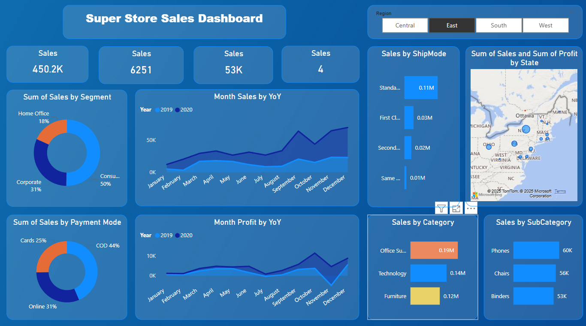
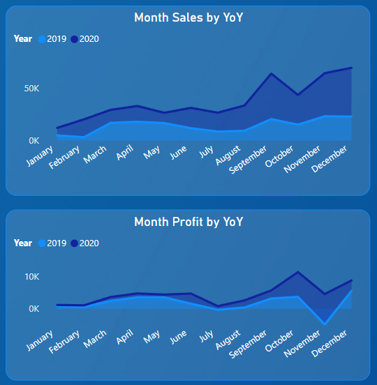

# 📊 Superstore-Sales-Analysis-Dashboard

## 🔎  Overview
This Power BI dashboard analyzes Superstore sales performance across
regions, categories, segments, and time to uncover key business insights.

##  📈 Key Metrics
- Total Sales: 450K+
- Orders: 6,251
- Quantity Sold: 53K
- Regions: Central, East, South, West

##  📈 Key Insights
- Consumer segment contributes the highest sales (~50%)
- Technology is the top-performing category
- Sales peak during Q4
- Standard Class is the most used shipping mode

## 🛠️ Tools Used
- Power BI Desktop
- DAX
- Data Modeling
- Data Visualization

## 📊 Dashboard Preview

## 📈 Year over Year

### Month Sales & Profit by Year-over-Year

## 📝 Conclusion

This "Superstore Sales Dashboard" reveals that the store generated $450.2K in total sales
across 6,251 orders with 53K units sold** across 4 regions (Central, East, South, West).

Consumer segment dominates with 50% of sales, followed by Corporate (31%) and 
Home Office (18%). Standard Class is the most preferred shipping mode.

Year-over-Year analysis shows a consistent growth trend in 2020 vs 2019, 
with peak sales observed in Q4 (October–December), suggesting strong seasonal demand.

These insights can help the business focus on high-performing regions, optimize 
shipping strategies, and plan inventory ahead of peak seasons.

